# AI-Code-Reviewer
Author: Dylan L, Alex Aussawlaithong, Dayamoy Datta Saikat

Code Reviews are an important part of Software Development. This essential process of reviewing code from peers can be very time consuming, which drastically affects the productivity of the Software development group. By creating a tool that can generate a summary of written code, we can cut down on the overhead involved in reviewing code.

## Project Status

✅ **Phase 1**: Dataset exploration and architecture design  
✅ **Phase 2**: Indexing implementation (Dense FAISS + Sparse BM25 + Hybrid Retrieval)  
🔄 **Phase 3**: Query Processing (In Progress)  
⏳ **Phase 4**: Prompt Construction  
⏳ **Phase 5**: LLM Generation  

## Quick Start

### Setup
```bash
# Clone and navigate to repository
cd AI-Code-Reviewer

# Run setup script (creates venv, installs dependencies)
chmod +x setup_indexing.sh
./setup_indexing.sh

# Or manually:
python3 -m venv venv
source venv/bin/activate
pip install -r requirements.txt
```

### Test Indexing (Phase 2)
```bash
# Run demo (creates sample data + builds indexes + tests retrieval)
python3 src/indexing/demo_indexing.py

# Or build indexes from your unified dataset
python3 src/indexing/build_indexes.py \
  --dataset Datasets/Unified_Dataset/train.jsonl \
  --output data/indexes
```

See `INDEXING_IMPLEMENTATION.md` for detailed Phase 2 documentation.

```mermaid
flowchart TD
    subgraph HYBRID_RAG["HYBRID RAG ARCHITECTURE"]

    %% Phase 1
    subgraph PH1["Phase 1: Data Preparation (Offline)"]
        T1[Task 1: Quality Dataset<br/>~116K samples]
        T2[Task 2: Comment Dataset<br/>~116K samples]
        T3[Task 3: Refinement Dataset<br/>~116K samples]
        Merger[Data Merger Module]
        Hash[Generate Unique Keys<br/>MD5 Hash: old_file + diff_hunk]
        Align[Alignment Engine<br/>Match samples across datasets]
        Unified[Unified Dataset<br/>Structure: code_change_id,<br/>old_file, diff_hunk,<br/>quality_label, review_comment,<br/>refined_code, language]
        Categorize[Categorization<br/>- Complete: all 3 annotations<br/>- With Comment: 2 annotations<br/>- Labeled Only: 1 annotation]
        Store[(Unified Data Store<br/>JSONL Format)]

        T1 --> Merger
        T2 --> Merger
        T3 --> Merger
        Merger --> Hash
        Hash --> Align
        Align --> Unified
        Unified --> Categorize
        Categorize --> Store
    end

    %% Phase 2
    subgraph PH2["Phase 2: Indexing (Offline)"]
        Embed[Embedding Generator<br/>Model: CodeBERT/GraphCodeBERT]
        VDB1[(Dense Vector Index<br/>Semantic Search<br/>FAISS/Qdrant)]
        TokenIdx[Tokenizer & Indexer<br/>Code-aware tokenization]
        VDB2[(Sparse Index<br/>BM25/Elasticsearch<br/>Keyword Search)]
        ASTParser[AST Parser<br/>Code structure extraction]
        VDB3[(Structure Index<br/>AST-based matching)]

        Store --> Embed
        Embed --> VDB1

        Store --> TokenIdx
        TokenIdx --> VDB2

        Store --> ASTParser
        ASTParser --> VDB3
    end

    %% Phase 3
    subgraph PH3["Phase 3: Query Processing (Online)"]
        UserQuery[User Code Change<br/>diff_hunk input]
        PreProcess[Preprocessor<br/>- Extract code features<br/>- Detect language<br/>- Parse diff]
        EmbedQuery[Embed Query<br/>Same model as indexing]
        TokenQuery[Tokenize Query<br/>Extract keywords]
        ASTQuery[Parse Query<br/>Extract structure]
        Ret1[Dense Retriever<br/>Cosine Similarity]
        Ret2[Sparse Retriever<br/>BM25 Scoring]
        Ret3[Structure Retriever<br/>Tree Edit Distance]
        RRF[Reciprocal Rank Fusion<br/>Combine & Rerank<br/>RRF Score Calculation]
        Filter[Smart Filtering<br/>- Prioritize complete samples<br/>- Group by quality<br/>- Language matching]
        TopK[Top-K Results<br/>5-7 best matches]

        UserQuery --> PreProcess
        PreProcess --> EmbedQuery
        PreProcess --> TokenQuery
        PreProcess --> ASTQuery
        EmbedQuery --> Ret1
        TokenQuery --> Ret2
        ASTQuery --> Ret3
        VDB1 -.->|Search| Ret1
        VDB2 -.->|Search| Ret2
        VDB3 -.->|Search| Ret3
        Ret1 -->|Top-5 results| RRF
        Ret2 -->|Top-5 results| RRF
        Ret3 -->|Top-3 results| RRF
        RRF --> Filter
        Filter --> TopK
    end

    %% Phase 4
    subgraph PH4["Phase 4: Prompt Construction (Online)"]
        Analyze[Result Analyzer<br/>- Count good vs bad<br/>- Check completeness<br/>- Extract patterns]
        Builder[Prompt Builder<br/>Template Selection]
        PT[Structured Prompt<br/>System: Role definition<br/>Examples: 1-2 good + 3-4 bad<br/>User Query: Code change<br/>Instructions: Output format]

        TopK --> Analyze
        Analyze --> Builder
        Builder --> PT
        UserQuery -.->|Include| Builder
    end

    %% Phase 5
    subgraph PH5["Phase 5: LLM Generation (Online)"]
        LLM[Large Language Model<br/>GPT-4/Claude/Llama]
        Response[Generated Response<br/>1. Quality Assessment<br/>2. Issues Found<br/>3. Review Comments<br/>4. Refined Code]

        PT --> LLM
        LLM --> Response
    end

    Response --> Output[Final Output to User]
    end

    %% Styling
    style T1 fill:#e1f5ff
    style T2 fill:#e1f5ff
    style T3 fill:#e1f5ff
    style Unified fill:#c8e6c9
    style VDB1 fill:#fff9c4
    style VDB2 fill:#fff9c4
    style VDB3 fill:#fff9c4
    style RRF fill:#fff9c4
    style LLM fill:#f8bbd0
    style Output fill:#b2dfdb
```


